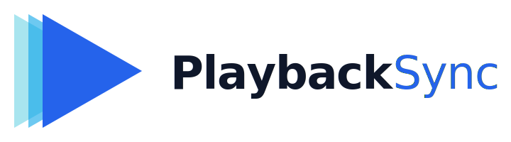

<p align="center">
  
</p>

<p align="center">
  <strong>Watch videos in sync with friends, hosted on your own Nextcloud.</strong><br>
  <sub>Coordinates timestamps and play/pause across viewers — never relays the video itself.</sub>
</p>

---

## What it is

PlaybackSync is a Nextcloud app for **synchronised video playback across a small group**. Each participant streams the video from wherever they would normally — Netflix, YouTube, a self-hosted file, anything in a browser — and PlaybackSync keeps everyone at the same timestamp.

Because the actual video bytes never pass through the server, PlaybackSync runs comfortably on a self-hosted Nextcloud with home-grade bandwidth: synchronising a play/pause/seek event is a few hundred bytes; relaying a 1080p stream to six people is not.

## Status

| Phase | Capability | Status |
|---|---|---|
| 1 | Owner-only room CRUD via the Nextcloud UI | **Shipped** |
| 1 | TTL-based room expiry + hourly prune job | **Shipped** |
| 2 | WebSocket sync server (drift correction, reconnect replay) | **Shipped** |
| 3 | Browser-extension client (drives the actual video player) | Planned |

You can use the rooms UI today. The WebSocket server is ready for a client to connect to it; the in-browser client that closes the loop is the next deliverable.

---

## Setup

PlaybackSync has two pieces an administrator installs:

1. The **Nextcloud app** (this repo) — handles the rooms UI, the database, and the REST API.
2. The **WebSocket sync daemon** — a long-running PHP process launched by `occ`, responsible for real-time playback events.

Both live in the same repository. Most of the work is one-time configuration.

### 1. Install the app

Drop the repo into your Nextcloud's `apps-extra/` (or `apps/`) directory:

```bash
cd /var/www/nextcloud/apps-extra
git clone https://github.com/RalkeyOfficial/PlaybackSync.git playbacksync
cd playbacksync
composer install --no-dev
```

Enable it:

```bash
sudo -u www-data php /var/www/nextcloud/occ app:enable playbacksync
```

The migration creates `oc_playbacksync_rooms`. Logged-in users can now create rooms from the navigation entry.

By default any logged-in user can create rooms. To restrict creation to admins:

```bash
sudo -u www-data php /var/www/nextcloud/occ config:app:set playbacksync restrict_to_admins --value true
```

### 2. Run the WebSocket sync daemon

The daemon binds a local TCP port (default `127.0.0.1:8765`). Your existing Nextcloud reverse proxy (Apache or nginx) forwards `/apps/playbacksync/ws/` to that port.

**A. Sample systemd unit** — `/etc/systemd/system/playbacksync-ws.service`:

```ini
[Unit]
Description=PlaybackSync WebSocket sync server
After=network-online.target mariadb.service redis.service
Wants=network-online.target

[Service]
Type=simple
User=www-data
Group=www-data
WorkingDirectory=/var/www/nextcloud
ExecStart=/usr/bin/php /var/www/nextcloud/occ playbacksync:ws-serve
Restart=on-failure
RestartSec=5
RuntimeMaxSec=7d

[Install]
WantedBy=multi-user.target
```

```bash
sudo systemctl daemon-reload
sudo systemctl enable --now playbacksync-ws.service
```

**B. Reverse-proxy snippet** — for nginx, add **above** the catch-all `location /` in the server block already serving Nextcloud:

```nginx
location ^~ /apps/playbacksync/ws/ {
    proxy_pass http://127.0.0.1:8765;
    proxy_http_version 1.1;
    proxy_set_header Upgrade $http_upgrade;
    proxy_set_header Connection "upgrade";
    proxy_set_header Host $host;
    proxy_read_timeout 3600s;
    proxy_send_timeout 3600s;
}
```

For Apache (`mod_proxy_wstunnel`):

```apache
ProxyPass        "/apps/playbacksync/ws/" "ws://127.0.0.1:8765/apps/playbacksync/ws/"
ProxyPassReverse "/apps/playbacksync/ws/" "ws://127.0.0.1:8765/apps/playbacksync/ws/"
```

Reload your web server. Clients can now connect to `wss://your-host/index.php/apps/playbacksync/ws/{roomUuid}`.

### 3. Verify

A WebSocket handshake without any client tooling:

```bash
curl -sS -i --max-time 3 -N \
  -H "Connection: Upgrade" -H "Upgrade: websocket" \
  -H "Host: $(hostname)" \
  -H "Sec-WebSocket-Version: 13" \
  -H "Sec-WebSocket-Key: dGhlIHNhbXBsZSBub25jZQ==" \
  https://$(hostname)/apps/playbacksync/ws/probe
```

Expect `HTTP/1.1 101 Switching Protocols`. Anything else is the proxy, not the daemon.

For a fuller end-to-end check using `websocat`:

```bash
websocat 'wss://your-host/apps/playbacksync/ws/<roomUuid>'
> {"type":"JOIN","password":"<plaintext-password-from-creation-dialog>"}
< {"type":"ROOM_STATE","clientId":"…","playerState":"paused","videoPos":0,…}
```

### 4. Tune (optional)

All daemon parameters are `IAppConfig` keys with sensible defaults. The full table — drift thresholds, tombstone window, idle timeout, rate limits — is in [docs/ws-sync-server.md](docs/ws-sync-server.md).

```bash
# Example: bind 0.0.0.0 instead of loopback
sudo -u www-data php /var/www/nextcloud/occ config:app:set playbacksync ws_host --value 0.0.0.0
```

---

## How participants use it

1. A user creates a room in the Nextcloud UI. The dialog shows a one-time password and a share link — the password is **never** displayed again.
2. They share the link + password with whoever they want to watch with.
3. Each participant opens the link, presents the password, and the WebSocket sync keeps them aligned.

The browser-extension that drives the actual `<video>` element on the target site is on the roadmap (Phase 3).

---

## For developers

```bash
# Frontend (Vue 3 + Pinia)
npm install
npm run dev          # builds the bundle once
npm run watch        # rebuild on change

# Backend (PHP)
composer install
npm run test:php     # PHPUnit, runs inside the Nextcloud Docker container
```

The repo is set up to work inside the [`nextcloud-docker-dev`](https://github.com/juliusknorr/nextcloud-docker-dev) workspace; the `test:php` script execs into the container directly.

| Document | Best for… |
|---|---|
| [docs/architecture.md](docs/architecture.md) | The system overview and how requests flow end-to-end |
| [docs/backend.md](docs/backend.md) | PHP under `lib/`: bootstrap, DB, services, controllers |
| [docs/frontend.md](docs/frontend.md) | Vue under `src/`: stores, components, l10n |
| [docs/api.md](docs/api.md) | The HTTP REST contract |
| [docs/ws-sync-server.md](docs/ws-sync-server.md) | Operator guide for the WebSocket daemon |
| [docs/ws-protocol.md](docs/ws-protocol.md) | Wire-format reference for the WebSocket protocol |
| [docs/configuration.md](docs/configuration.md) | All `IAppConfig` keys and `occ` commands |

Per-feature shaping documents live under [`agent-os/specs/`](agent-os/specs/) — read them when you've forgotten *why* a slice of the code looks the way it does.

---

## License

[AGPL-3.0-or-later](LICENSE).
