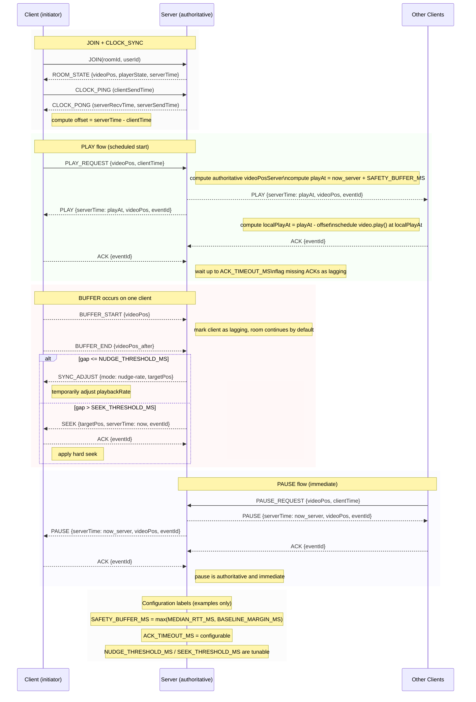

# Client–Server Sync Diagram & Event Handling

This document contains a connection diagram, event flows, priorities, and explicit handling rules for a single-server, WebSocket-based video sync system. It assumes a browser extension on the client implements the player control and local playback adjustments.

Throughout the doc each section explains: **what** the component/event is, **how** it should work in practice, and **why** the approach is chosen. All numeric values are expressed as labeled configuration parameters (with an example value included where helpful). Replace example values with your own measurements during testing.

---

## 1) High-level ASCII diagram (single server)

```
Client A                        Server                         Client B
  |-- WebSocket CONNECT ------->|                              |
  |                             |                              |
  |-- JOIN(roomId,userId) --->  |                              |
  |                             |                              |
  |<-- JOIN_ACK(state) -------  |                              |
  |                             |                              |
  |-- CLOCK_PING (t1) ------->  |                              |
  |<-- CLOCK_PONG (t2) ------   |                              |
  |  (compute offset)           |                              |
  |                             |                              |
  |-- PLAY_REQUEST(pos) ----->  |                              |
  |                             |-- BROADCAST(PLAY at T) --->  |
  |                             |                              |
  |<-- PLAY(at T) ------------- |                              |
  |  (schedule local play)      |                              |
```

What: minimal diagram for single-server architecture.
How: persistent WebSocket connection from each client to the server; join a room; perform clock sync on join; send play/pause/seek requests; server rebroadcasts authoritative events.
Why: single server simplifies conflict resolution and ordering; persistent connection reduces latency and provides ordered, low-latency delivery.

Notes: all messages are JSON over WSS. `serverTime` uses epoch ms. The diagram intentionally omits load balancers or pub/sub as they are not being used in the final product.

---

## 2) Message types (canonical shapes)

All messages contain: `{ type, roomId, eventId, sourceClientId, seq }` unless noted.

For each message below I list: **what** the message represents, **how** clients/servers should construct/interpret it, and **why** this shape is chosen.

Control events (highest priority):

- `PLAY_REQUEST`
  - What: client asks server to start playback from a given position.
  - How: `{ type: "PLAY_REQUEST", videoPos, clientTime }` where `clientTime` = local epoch ms when the button was pressed.
  - Why: server needs the client-claimed position and timestamp to compute an authoritative start time and to handle conflicting concurrent requests.

- `PLAY` (server broadcast)
  - What: authoritative command from server to start playback at a specific server timestamp.
  - How: `{ type: "PLAY", serverTime, videoPos, eventId }` where `serverTime` is the server's epoch ms *at which clients should start playing*.
  - Why: including `serverTime` lets each client schedule the local action at the same real-world instant, compensating for different RTTs and client clock offsets.

- `PAUSE_REQUEST` and `PAUSE`
  - What: similar to PLAY but pauses immediately.
  - How: `PAUSE_REQUEST` carries `videoPos` and `clientTime`; server replies with `PAUSE` including the authoritative `videoPos` and `serverTime` (usually serverTime≈now).
  - Why: Pause is user-visible and should be authoritative; sending the server's position ensures all clients pause at the same canonical point.

- `SEEK_REQUEST` and `SEEK`
  - What: user wishes to jump to a new position.
  - How: `SEEK_REQUEST { targetPos, clientTime }`. Server validates and broadcasts `SEEK { serverTime: now, targetPos, eventId }`.
  - Why: synchronizes the new timeline across clients and prevents client-side divergent histories.

State / sync events (medium priority):

- `HEARTBEAT`
  - What: regular status update from client to server.
  - How: `{ type: "HEARTBEAT", currentPos, playerState, clockSample }`.
  - Why: allows the server to measure drift, detect buffering, and compute aggregate metrics without forcing immediate corrections.

- `SYNC_ADJUST`
  - What: server-driven corrective action.
  - How: `{ type: "SYNC_ADJUST", serverTime, targetPos, mode }` where `mode` ∈ {`nudge-rate`, `seek`}.
  - Why: provides a structured instruction set for small or large corrections.

- `CLOCK_PING` / `CLOCK_PONG`
  - What: offset measurement packets (NTP-style).
  - How: include clientSendTime, serverRecvTime, serverSendTime, clientRecvTime.
  - Why: needed to calculate per-client clock offset and RTT.

Health / buffering (high-medium priority):
- `BUFFER_START`, `BUFFER_END`
  - What: client signals that it has started or finished rebuffering.
  - How: `{ type: "BUFFER_START", videoPos }` and `{ type: "BUFFER_END", videoPos }`.
  - Why: server uses these to avoid waiting indefinitely for stuck clients and to decide whether to instruct catch-up behaviour or pause the room.

Control acknowledgements (important):
- `ACK` / `NACK`
  - What: clients acknowledge receipt and application of critical control events.
  - How: `{ type:"ACK", eventId }`.
  - Why: server can detect missing clients or stalled connections and take alternate action after `ACK_TIMEOUT`.

Administrative (low priority):
- `ROOM_STATE`
  - What: full authoritative state returned on join or reconnect.
  - How: includes `{ videoPos, playerState, lastEventId, serverTime }`.
  - Why: lets new or reconnected clients immediately converge to the canonical timeline.

---

## 3) Priority table and handling semantics

What: ordered priority list and handling rules.
How: the server enqueues incoming requests and applies rules below to process them.
Why: prioritization reduces user-visible inconsistencies and avoids blocking the room for a single problematic client.

1. **Highest — Control events**: `PLAY`, `PAUSE`, `SEEK` (server broadcasts).
   - How: Apply in eventId order; require an `ACK`. If `ACK` not received within `ACK_TIMEOUT`, mark client `lagging` but proceed for others.
   - Why: user-visible controls determine the session’s perceived correctness and responsiveness.

2. **High — Buffering notifications**: `BUFFER_START`/`BUFFER_END`.
   - How: immediate state change on server for that client; used to alter subsequent scheduling or flag for catch-up.
   - Why: buffer events indicate media-plane failure (not network), which needs different handling than missing ACKs.

3. **Medium — Heartbeats and sync**: `HEARTBEAT`, `SYNC_ADJUST`.
   - How: used for non-urgent corrections (nudge or seek decisions).
   - Why: avoid constantly interrupting playback while still converging over time.

4. **Low — Telemetry and admin**: `ROOM_STATE` dumps, logs.
   - How: asynchronous.
   - Why: diagnostic and recovery data.

Design rationale: keep authoritative timeline responsive while avoiding oscillatory corrections from chasing minute differences.

---

## 4) Event handling flow (server and client) — step by step

This section expands each flow with direct what/how/why reasoning.

### On client connect / join
What: client joins a room and must align to canonical time.
How (step-by-step):
1. Client connects WSS and sends `JOIN(roomId,userId)`.
2. Server replies `ROOM_STATE { videoPos, playerState, lastEventId, serverTime }`.
3. Client performs `CLOCK_SYNC` (3–5 ping/pong exchanges) to compute `offset = serverTime - clientTime` and RTT.
4. Client compares local `currentTime` to `videoPos` from server. If `|delta| > JOIN_SEEK_THRESHOLD` then client seeks to server `videoPos` and does not auto-play until further instruction.

Why: joining clients commonly have arbitrary local state; immediate clock sync plus a seek threshold ensures that they do not silently diverge or cause surprise jumps when the next control event is applied. Doing a small number of ping/pong exchanges balances accuracy with connect latency.

### On PLAY_REQUEST (client presses play)
What: a user wishes to start playback for the group.
How:
1. Client sends `PLAY_REQUEST {videoPos, clientTime}`.
2. Server calculates authoritative `videoPosServer` (may accept client value or re-sample), computes `playAt = now_server + SAFETY_BUFFER_MS`.
   - `SAFETY_BUFFER_MS` is a labeled configuration representing the scheduling buffer. Example: `SAFETY_BUFFER_MS` = 500 ms (example only).
   - How to compute: `SAFETY_BUFFER_MS = max(MEDIAN_RTT_MS, BASELINE_MARGIN_MS)`.
3. Server broadcasts `PLAY { serverTime: playAt, videoPos: videoPosServer, eventId }`.
4. Clients compute `playAtLocal = playAt - offset` and schedule `video.play()` at that local moment. Each client replies `ACK(eventId)`.
5. Server waits up to `ACK_TIMEOUT_MS` for ACKs, flags missing clients as `lagging`, and logs.

Why: using a scheduled `playAt` avoids race conditions where clients with lower RTT start earlier than slower ones. The safety buffer provides the window for the message to travel and be processed on clients. ACKs give the server visibility into who applied the command.

Edge cases and specifics:
- If a client experiences `BUFFER_START` between receiving `PLAY` and the scheduled `playAtLocal`, the client should cancel or defer the scheduled play and immediately notify server with `BUFFER_START`.
- The server's policy (default) is not to pause the entire room for a single buffer; instead, it flags the client and later issues a targeted `SYNC_ADJUST`.

### On PAUSE_REQUEST
What: a user wants to pause the room.
How:
1. Client sends `PAUSE_REQUEST {videoPos, clientTime}`.
2. Server converts to authoritative `videoPosServer` and immediately broadcasts `PAUSE { serverTime: now_server, videoPos: videoPosServer, eventId }`.
3. Clients apply pause immediately and send `ACK`.

Why: pauses are typically user-triggered synchronous events that participants expect to happen immediately. Delaying a pause for a buffer window confuses users.

### On SEEK_REQUEST
What: user requests to jump to a particular time.
How:
1. Client sends `SEEK_REQUEST { targetPos, clientTime }`.
2. Server validates (e.g., clamp within video duration) and broadcasts `SEEK { serverTime: now_server, targetPos, eventId }`.
3. Clients `video.pause(); video.currentTime = targetPos; send ACK(eventId)`. The server waits for ACKs and expects a `PLAY` to resume if appropriate.

Why: seeks change the canonical timeline, so immediate authoritative broadcasting avoids divergent histories.

### On BUFFER_START / BUFFER_END
What: a client signals that media playback stalled (buffering) and when it resumes.
How:
- `BUFFER_START` sent immediately when playback stalls.
- `BUFFER_END` sent once the media has enough buffered content to resume smoothly (report `currentPos`).

Server behaviour:
- **continue** for the majority. Server marks the client `lagging` and optionally sends `SYNC_ADJUST` when client reports `BUFFER_END`.

Why: Improves overall experience for the majority and avoids repeatedly interrupting many users for one bad connection.

---

## 5) Resynchronization strategy and thresholds

What: how to keep drift below a perceptual threshold.
How: provide three correction methods and cadences, with labeled parameters.
Why: to minimize visible jumps and maintain perceived simultaneity.

Correction actions (labels and example usage):

- `NUDGE_THRESHOLD_MS` (example: 50–300 ms)
  - What: threshold under which a gentle correction is preferred.
  - How: temporarily adjust `video.playbackRate` by a small multiplier for a short period (e.g., `1.02` or `0.98`) until the gap closes.
  - Why: smooth audible and visual experience, avoids abrupt seeks for tiny skew.

- `SEEK_THRESHOLD_MS` (example: 500 ms)
  - What: threshold above which a hard seek is preferable.
  - How: client sets `video.currentTime = targetPos` immediately (optionally pause briefly to avoid decoding artifacts), then await `PLAY`.
  - Why: big gaps degrade the group experience and occasional jumps are better than prolonged desynchronization.

- `JOIN_SEEK_THRESHOLD_MS` (example: 500 ms)
  - What: threshold used on initial join to decide whether to seek to room state.
  - How: if joining client's `currentTime` differs from server `videoPos` by more than this, immediately seek to server `videoPos`.

- `CLOCK_SYNC_INTERVAL_S` (example: 30–60s)
  - What: how often to re-run clock sync samples.
  - How: on join run 3–5 exchanges, then again every `CLOCK_SYNC_INTERVAL_S` or after major RTT changes.
  - Why: clocks drift and network conditions change; periodic resync keeps offsets accurate.

- `HEARTBEAT_INTERVAL_S` (example: 5s)
  - What: client heartbeat frequency for position reporting.
  - How: clients send `HEARTBEAT` every `HEARTBEAT_INTERVAL_S` including `currentPos` and `playerState`.
  - Why: server uses these to detect drift and buffering without overwhelming the network.

- `ACK_TIMEOUT_MS` (example: 2500 ms)
  - What: how long server waits for ACKs on critical events.
  - How: after broadcasting a control event, server waits up to `ACK_TIMEOUT_MS`. Missing ACKs mark the client lagging.
  - Why: gives slower clients a fair chance to respond while keeping the room responsive.

Adaptive behaviour:
- Make thresholds dynamic where possible. For example, compute `SAFETY_BUFFER_MS = max(MEDIAN_RTT_MS, BASELINE_MARGIN_MS)` to adapt to the current cohort’s latency profile.

---

## 6) Ordering, idempotency, and conflict resolution

What: rules to ensure consistent application of events across clients.
How:
- Server attaches monotonically increasing `eventId` to authoritative broadcasts.
- Clients apply events in `eventId` order and buffer out-of-order messages for a short `EVENT_REORDER_WINDOW_MS` (example: 200ms).
- Event handlers are idempotent (ignoring duplicate `eventId`).
- Conflicting requests: server serializes by arrival. Optionally designate a `HOST` role that has higher priority.
Why: ordering prevents inconsistent timelines and idempotency avoids double application in case of retries.

---

## 7) Reconnect and recovery

What: how a reconnecting client catches up.
How:
1. Re-establish WSS and `JOIN` the room.
2. Immediately run `CLOCK_SYNC` to recompute offset.
3. Request `ROOM_STATE`; server returns `{ videoPos, playerState, lastEventId }` and any `recentEvents[]` since `lastEventId`.
4. If `|localPos - videoPos| > JOIN_SEEK_THRESHOLD_MS`, client seeks to `videoPos` and sets `playerState` accordingly.
5. If events need replay, server streams them in `eventId` order; client ACKs each.
Why: ensures consistent recovery and avoids inconsistent application of stale events.

---

## 8) Timeouts, retries and metrics

What: operational parameters to detect problems and measure health.
How:
- `ACK_TIMEOUT_MS`: default 2500 ms. Retransmit up to 2 times for critical broadcasts; do not retry indefinitely.
- `JOIN_TIMEOUT_MS`: default 3000 ms.
- Metrics collected: RTT distribution, percent of clients lagging beyond `SEEK_THRESHOLD_MS`, ACK success rate, average drift.
Why: operational health is essential to tuning thresholds and for diagnosing regions where the defaults are insufficient.

---

## 9) Example JSON sequences (with labeled parameters)

Play flow (client -> server -> clients)

1. Client A -> Server: `{ type:"PLAY_REQUEST", videoPos: 123.45, clientTime: 167XXXX }`
2. Server -> all: `{ type:"PLAY", serverTime: playAt /* = now_server + SAFETY_BUFFER_MS */, videoPos: 123.45, eventId: 42 }`
   - Note: `SAFETY_BUFFER_MS` is a label; in earlier examples an instance used 500 ms as an example.
3. Client B receives -> computes local play time -> schedules `play()` -> sends `{ type:"ACK", eventId:42 }`

Resync flow (server detects drift)

1. Server -> client C: `{ type:"SYNC_ADJUST", mode:"nudge-rate", serverTime: now, targetPos: 130.32 }`
2. Client C briefly increases `playbackRate` until `currentTime` ≈ `targetPos` then restores normal rate.

---

## 10) Summary of recommended labeled parameters (examples)

- `HEARTBEAT_INTERVAL_S` = 5 (example)
- `CLOCK_SYNC_EXCHANGES` = 3 on join, re-run every `CLOCK_SYNC_INTERVAL_S` = 30–60 (example)
- `SAFETY_BUFFER_MS` = max(MEDIAN_RTT_MS, `BASELINE_MARGIN_MS`) (example baseline margin: 200 ms; instance example: 500 ms)
- `ACK_TIMEOUT_MS` = 2500 (example)
- `JOIN_SEEK_THRESHOLD_MS` = 500 (example)
- `NUDGE_THRESHOLD_MS` = 50–300 (example)
- `SEEK_THRESHOLD_MS` = 500 (example)

Each of these labels should be made configurable in the server and client code. Start with the example values, run tests with representative users, and tune to your user geography and content characteristics.

---

## 11) Mermaid diagram

Github will automatically display this diagram in a visual format.
if you cannot see it visually go to https://mermaid.live/ and paste this in.



